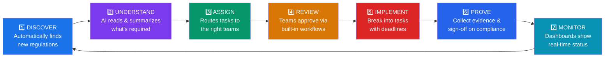
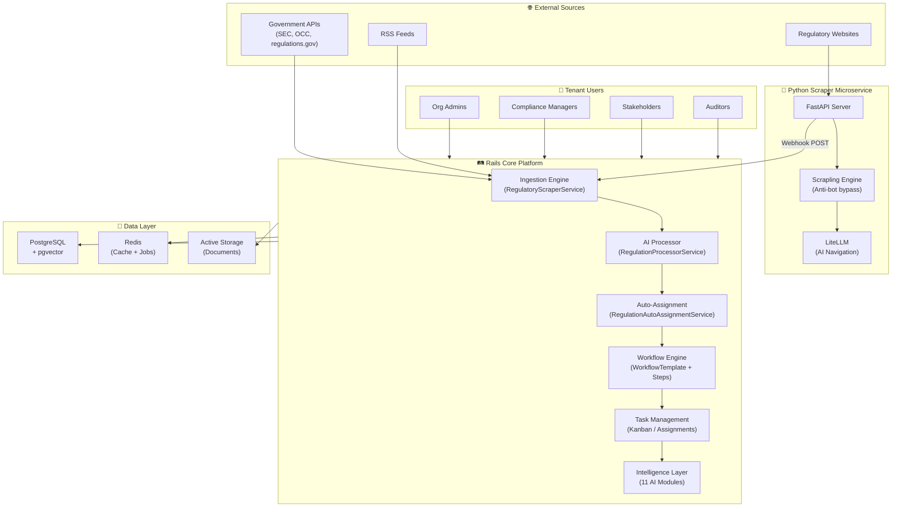
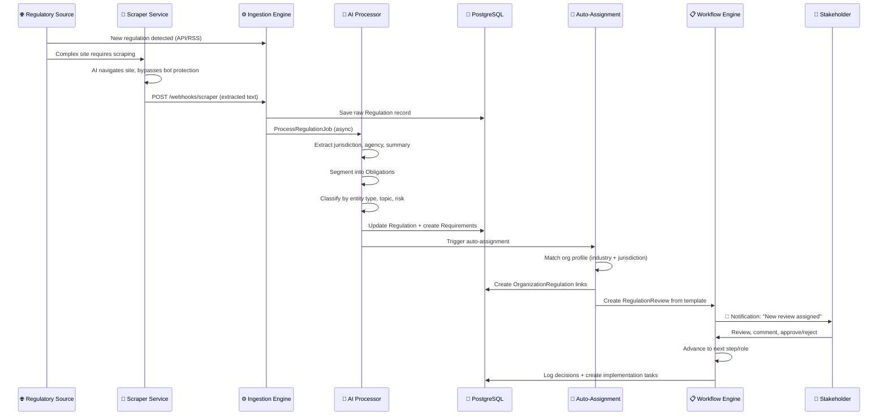
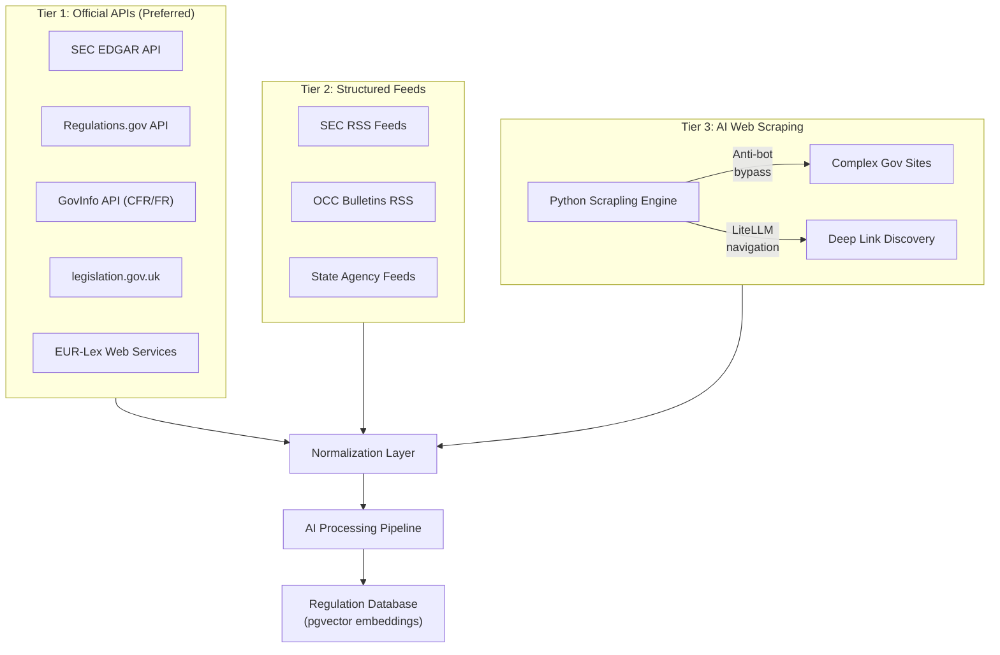
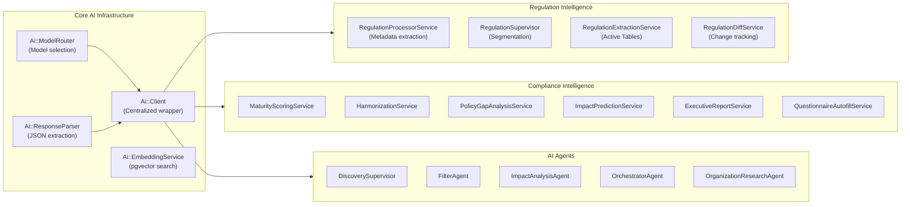
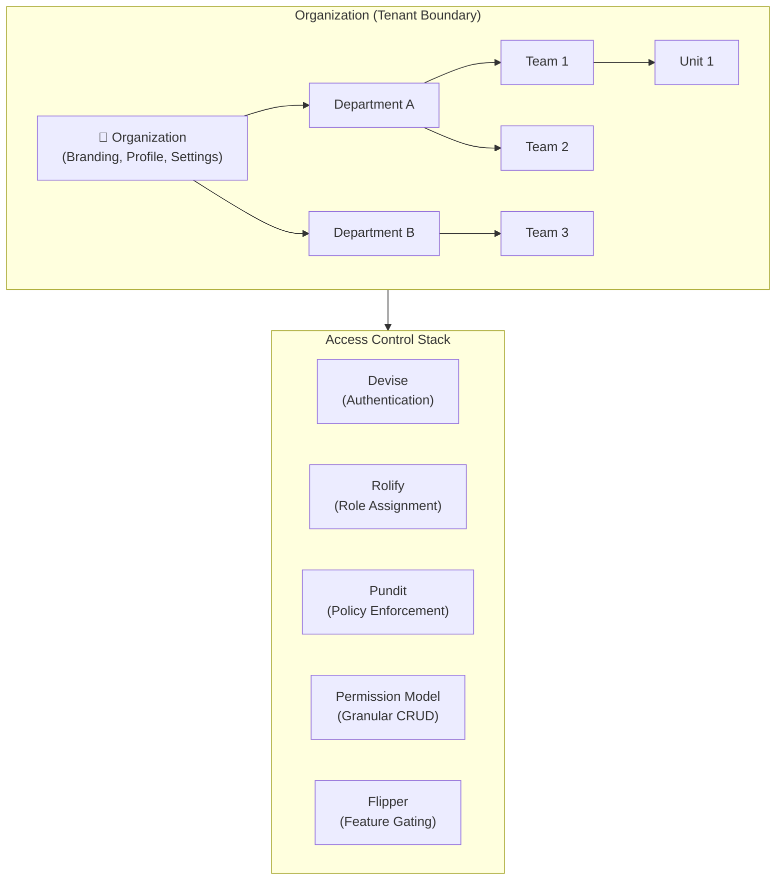

<p align="center">
  <h1 align="center">🏛️ ComplyFlow</h1>
  <p align="center"><strong>The AI-Native Compliance Operating System</strong></p>
  <p align="center">
    Automated regulatory intelligence · Multi-tenant GRC · AI-powered workflows
  </p>
</p>

---

## What Is ComplyFlow?

ComplyFlow is a **compliance management platform** that helps companies stay on top of ever-changing laws and regulations — automatically.

Think of it like a smart assistant for your legal and compliance teams: it watches for new rules from government agencies, reads and summarizes them using AI, tells the right people in your company what they need to do, and tracks everything until it's done.

### The Problem It Solves

Every company operating in regulated industries (finance, healthcare, insurance, etc.) must follow hundreds of rules from dozens of government agencies. Those rules change **constantly**. Today, most companies track this in spreadsheets, email chains, and manual processes — it's slow, error-prone, and expensive.

### How ComplyFlow Fixes It



| Without ComplyFlow | With ComplyFlow |
|---|---|
| Regulations change weekly — teams find out too late | **Automatic monitoring** of 10+ government sources |
| Staff manually read 100-page legal documents | **AI summarizes obligations** in seconds |
| "Who handles this?" is a daily question | **Auto-routes** to the right department |
| Compliance tracked in scattered spreadsheets | **One dashboard** across all frameworks |
| Auditors ask for proof and teams scramble | **Evidence trail** is always up to date |

### Real-World Example: A FinTech Onboards

| Timeline | What Happens |
|---|---|
| **Day 1** | Admin sets up the company, selects industry (FinTech) and locations (US, NY, CA) |
| **Day 1** | ComplyFlow auto-matches 40+ relevant regulations (SEC, CFPB, CCPA, NYDFS) |
| **Day 2** | Review workflows begin — Legal gets SEC rules, Privacy team gets data protection rules |
| **Week 1** | Teams approve applicable rules; AI breaks them into 200+ actionable requirements |
| **Week 2** | Requirements become trackable tasks on Kanban boards with owners and due dates |
| **Ongoing** | Evidence is collected, dashboards update in real-time |
| **Audit Day** | One-click report generation with a complete, tamper-proof evidence trail |

### Key Capabilities at a Glance

| Capability | What It Does |
|---|---|
| 🌐 **Regulatory Monitoring** | Continuously watches government agencies for new and changed rules |
| 🤖 **AI Analysis** | Reads legal text and extracts who needs to do what, by when |
| 📋 **Workflow Automation** | Routes reviews and approvals through configurable multi-step processes |
| 📊 **Compliance Dashboards** | Real-time visibility across all frameworks (SOC 2, HIPAA, ISO 27001, etc.) |
| ⚖️ **Risk Management** | Visual risk heatmaps with control linkage |
| 🔍 **Control Testing** | Scheduled test plans, statistical sampling, and audit-ready sign-offs |
| 📄 **Policy Attestation** | Campaign-based policy acknowledgments with tamper-proof legal records |
| 🏢 **Multi-Tenant** | Supports many organizations on one platform, each fully isolated |
| 🚩 **Feature Flags** | Modules can be turned on/off per customer |
| 🔗 **API Access** | Programmatic access for integrations with other tools |

---

## Built With

> Ruby on Rails · PostgreSQL · Python · Google Gemini AI · Hotwire · Redis · Docker

---

<details>
<summary><h2>🔧 Technical Deep Dive (click to expand)</h2></summary>

### Platform Architecture



### Request & Data Flow



---

### Core Module Architecture

```mermaid
graph TB
    subgraph Core["🏗️ Core Platform"]
        MT["Multi-Tenancy<br/>(Organizations, Depts, Teams)"]
        UAC["User & Access Control<br/>(Devise, Pundit, Rolify)"]
        DOC["Document Management<br/>(Upload, Preview, Version)"]
    end

    subgraph GRC["⚖️ GRC Modules"]
        CF["Compliance Frameworks<br/>(Requirements, Controls)"]
        RM["Risk Management<br/>(Register, Heatmap)"]
        FR["Findings & CAPA<br/>(Auto-create, SLA, Root Cause)"]
        CT["Control Testing<br/>(Plans, Sampling, Sign-off)"]
        OB["Obligation Management<br/>(AI Extraction, Triggers)"]
        IB["Incident & Breach<br/>(Categories, Auto-findings)"]
        PA["Policy Attestation<br/>(Campaigns, Legal Records)"]
        EF["Evidence Freshness<br/>(Expiration, Auto-refresh)"]
    end

    subgraph Intelligence["🧠 Phase 5 Intelligence"]
        MA["Maturity Assessment"]
        HM["Cross-Framework<br/>Harmonization"]
        WI["Workflow Intelligence"]
        PG["Policy Gap Analysis"]
        IS["Impact Simulation"]
        ER["Executive Reports"]
        QA["Questionnaire Autofill"]
        VR["Vendor TPRM"]
        EA["Evidence Agents"]
        CM["Continuous Monitoring"]
        EI["Jira/Linear/ServiceNow"]
    end

    Core --> GRC
    GRC --> Intelligence
```



### Module Details

| Module | Description | Key Capability |
|---|---|---|
| **Compliance Frameworks** | Define and manage frameworks (SOC 2, ISO 27001, HIPAA, etc.) | AI-assisted requirement breakdown from regulation text |
| **Risk Management** | Risk register with severity/likelihood scoring | Visual heatmap + control linkage |
| **Findings & CAPA** | Corrective and Preventive Actions | Auto-created from failed tests or incidents, SLA tracking |
| **Control Testing** | Scheduled test plans with sampling strategies | Statistical sampling, reviewer sign-off, trend analysis |
| **Obligation Management** | AI-extracted duties from legal text | Conditional triggers (e.g., GDPR 72-hour breach notification) |
| **Incident Management** | Log breaches with 9 categories, 4 severity levels | Auto-triggers related obligations, creates findings |
| **Policy Attestation** | Campaign-based policy acknowledgment | Immutable legal records (IP, user agent, timestamp) |
| **Evidence Freshness** | Track document expiration dates | Auto-refresh requests before evidence goes stale |
| **Active Tables** | Spreadsheet-like AI queries on regulation text | Ask "What are the penalties?" — AI fills the column |
| **Executive Reports** | AI-generated compliance narratives | Board-ready PDF exports with maturity scores |
| **Vendor TPRM** | Third-party risk assessments | Track vendor compliance posture |

---

### The Regulatory Ingestion Engine

#### Source Strategy: "Golden Sources First"



#### Configurable Data Sources

Each `RegulatoryDataSource` record defines:

| Field | Purpose | Example |
|---|---|---|
| `source_type` | Ingestion strategy | `api`, `rss`, `web_scrape`, `external_scrapling` |
| `url` | Endpoint or page to monitor | `https://efts.sec.gov/LATEST/search-index?...` |
| `api_field_mapping` | Maps response JSON to internal fields | `{ results: "hits", title: "name", url: "url" }` |
| `pagination_strategy` | How to page through results | `page_number`, `offset`, or `none` |
| `active` | Enable/disable without deleting | `true` / `false` |

---

### AI Intelligence Layer



**AI Model:** Google Gemini (`gemini-2.0-flash` for generation, `text-embedding-004` for vector search)

---

### Multi-Tenancy & Access Control



- **`acts_as_tenant`** ensures every database query is scoped to the current organization
- **Rolify** defines roles (Super Admin, Org Admin, Compliance Manager, Stakeholder, Auditor)
- **Pundit policies** enforce row-level access checks on every controller action
- **Flipper flags** gate entire modules on/off per tenant (23 flags across all modules)

---

### Feature Flag System

All modules are gated behind **Flipper feature flags**, allowing per-tenant feature activation:

| Flag | Module | Phase |
|---|---|---|
| `compliance_management` | Frameworks, Requirements, Controls | Core |
| `risk_management` | Risk Register, Heatmap | Core |
| `document_management` | Document Library | Core |
| `policies` | Policy Management | Core |
| `regulatory_intelligence` | Regulation Library | Core |
| `findings_remediation` | Findings & CAPA | Phase 2 |
| `control_testing` | Test Plans & Execution | Phase 3 |
| `obligation_management` | Obligation Tracking | Phase 4 |
| `incident_management` | Incident & Breach | Phase 4 |
| `policy_attestation` | Attestation Campaigns | Phase 3 |
| `evidence_freshness` | Evidence Expiration | Core |
| `maturity_assessment` | Control Maturity Scoring | Phase 5A |
| `cross_framework_harmonization` | Framework Mapping | Phase 5A |
| `workflow_intelligence` | Workflow Analytics | Phase 5A |
| `policy_gap_analysis` | Policy Gap Detection | Phase 5A |
| `regulatory_impact_simulation` | Impact Simulation | Phase 5B |
| `executive_reporting` | Executive Reports | Phase 5B |
| `questionnaire_autofill` | Questionnaire/RFP Autofill | Phase 5B |
| `vendor_risk_management` | Vendor TPRM | Phase 5C |
| `evidence_agents` | Automated Evidence Collection | Phase 5C |
| `continuous_monitoring` | Monitoring Dashboard | Phase 5C |
| `external_integrations` | Jira/Linear/ServiceNow | Phase 5D |
| `compliance_exports` | CSV/PDF Exports | Core |

---

### Full Tech Stack

| Layer | Technology |
|---|---|
| **Backend** | Ruby on Rails 7.1 |
| **Scraper Microservice** | Python 3.12, FastAPI, Scrapling, LiteLLM |
| **Database** | PostgreSQL 15+ with `pgvector` extension |
| **Cache & Jobs** | Redis + Sidekiq |
| **Frontend** | Hotwire (Turbo + Stimulus), Tailwind CSS, ViewComponent |
| **Authentication** | Devise |
| **Authorization** | Pundit + Rolify |
| **Multi-Tenancy** | `acts_as_tenant` |
| **AI Models** | Google Gemini (via `ruby_llm` gem) |
| **Vector Search** | `neighbor` gem + pgvector |
| **Feature Flags** | Flipper |
| **File Storage** | Active Storage |
| **Document Processing** | LibreOffice, Poppler, Tesseract OCR, ImageMagick |
| **Testing** | RSpec, FactoryBot, Capybara |
| **Containerization** | Docker |

---

### Getting Started

#### Prerequisites

- Ruby 3.2+
- PostgreSQL 15+ (with `pgvector` extension enabled)
- Redis
- Node.js 18+ (for asset compilation)
- Python 3.12+ (for scraper microservice)

#### System Dependencies

```bash
# Ubuntu/Debian
sudo apt-get install -y poppler-utils tesseract-ocr tesseract-ocr-eng \
  libreoffice ghostscript imagemagick

# macOS
brew install poppler tesseract tesseract-lang libreoffice ghostscript imagemagick
```

#### Installation

```bash
# 1. Clone and install Ruby dependencies
git clone <repository-url>
cd compliance_tracker
bundle install

# 2. Set up the database
rails db:create db:migrate db:seed

# 3. Start Redis and Sidekiq (for background jobs)
redis-server &
bundle exec sidekiq &

# 4. Start the Rails server
bin/dev   # or: rails server
```

#### Running the Scraper Microservice

```bash
cd scraper_service
python3 -m venv venv
source venv/bin/activate
pip install -r requirements.txt
uvicorn main:app --port 8000 --reload
```

The scraper service exposes a FastAPI endpoint on port `8000` that the `RegulatoryScraperService` dispatches to for complex web scraping tasks.

#### Access the Platform

Visit `http://localhost:3000` — log in with seed credentials and start exploring.

---

### API

ComplyFlow exposes a versioned RESTful API at `/api/v1` for programmatic access:

- **Compliance data** — Frameworks, requirements, controls
- **Documents** — Upload, retrieve, search
- **Regulations** — Browse, filter, adopt
- **Organization management** — Users, roles, departments

API authentication is handled via Devise token authentication.

</details>

---

## License

This project is licensed under the MIT License.

---

<p align="center">
  <strong>ComplyFlow</strong> — Because compliance shouldn't be a full-time job.<br/>
  <em>Built by humans, powered by AI, trusted by auditors.</em>
</p>
